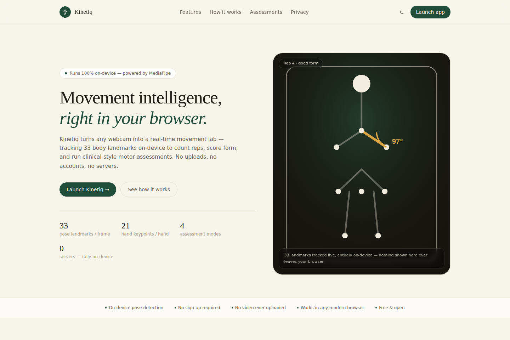
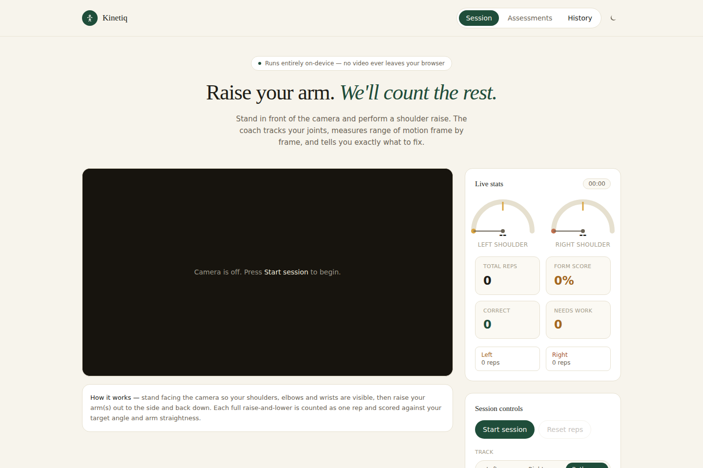
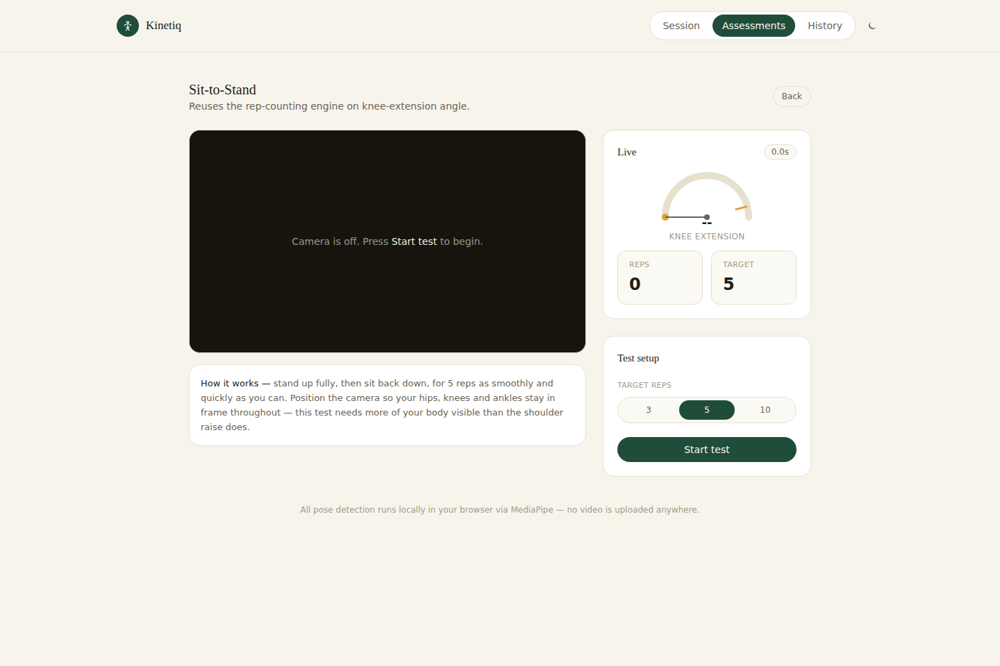
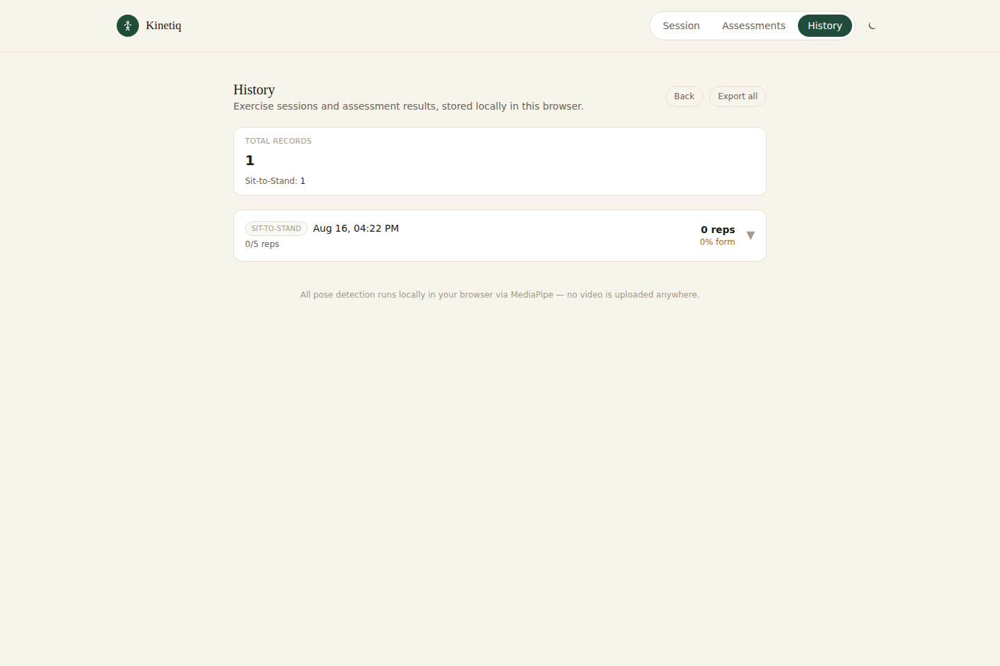

# Kinetiq

**Movement intelligence, right in your browser.**

Kinetiq turns any webcam into a real-time movement lab. It uses [MediaPipe Tasks
Vision](https://ai.google.dev/edge/mediapipe/solutions/vision/pose_landmarker) to track
33 body landmarks (and 21 hand keypoints per hand) entirely on-device, then layers a
custom rep-counting engine, form scoring, live voice coaching, and a four-test motor
assessment suite on top — with zero backend, zero accounts, and zero video ever leaving
the browser tab.

[**Live demo →**](#) &nbsp;·&nbsp; [Screenshots](#screenshots) &nbsp;·&nbsp; [Architecture](#architecture) &nbsp;·&nbsp; [Deploying](#deploying)

> Replace the live demo link above once you've deployed — see [Deploying](#deploying).

## Features

- **Real-time pose detection** — MediaPipe's Pose Landmarker (33 keypoints) and Hand
  Landmarker (21 keypoints/hand), GPU-accelerated with an automatic CPU fallback.
- **Hysteresis-based rep-counting engine** — a hand-rolled enter/exit-threshold state
  machine (`src/lib/repEngine.js`) turns noisy per-frame joint angles into clean,
  jitter-proof rep counts. One engine, reused across every exercise and assessment.
- **Live voice coaching** — spoken feedback via the Web Speech Synthesis API.
- **Motor assessment suite** — four standardized-style clinical tests built on the same
  landmark → angle → rep pipeline:
  - Sit-to-Stand (knee extension, reps, approximate postural sway)
  - Arm Movement (range of motion, speed, left/right asymmetry)
  - Hand Assessment (finger-tapping rate, pinch amplitude, hand asymmetry)
  - Walking/Gait (flagged in scope as a stretch goal — needs multi-frame trajectory
    analysis and a fixed side-on camera, so it ships as "coming soon")
- **Local session history** — every session and assessment result is saved to
  `localStorage`; export any record as JSON or CSV, no account required.
- **Real light & dark themes** — a CSS-custom-property design system that re-themes at
  runtime, not just an inverted dark overlay.
- **A real landing page** — marketing site, feature tour, and the app itself all live in
  one deployable bundle.

## Screenshots

<!-- Replace these with your own screenshots after deploying — see docs/screenshots -->

| Landing page | Live session |
| --- | --- |
|  |  |

| Motor assessment | Session history |
| --- | --- |
|  |  |

## Architecture

Kinetiq is a client-only single-page app — there is no server component to deploy.

```
src/
  components/
    landing/         Marketing page (nav, hero, features, how-it-works, footer)
    assessments/      Motor assessment flows (setup → live → summary per test)
    ...                Shared UI: camera stage, controls, stats, gauges, toasts
  hooks/
    useCamera.js       getUserMedia lifecycle, device enumeration
    useExerciseSession  Orchestrates the Phase-1 shoulder-raise coach
    useVisionTest.js    Shared camera + MediaPipe + RAF detection loop, reused by
                         every assessment hook
    useSitToStandTest / useArmAssessment / useHandAssessment
                         Per-test tracking logic built on useVisionTest + RepTracker
  lib/
    vision.js           MediaPipe FilesetResolver + landmarker singletons (GPU→CPU
                         fallback), self-hosted WASM runtime (no CDN dependency)
    geometry.js          Angle-at-joint math, signal smoothing, distance/stdDev helpers
    landmarks.js          Named landmark indices for pose/hand chains
    repEngine.js          Generic hysteresis rep-counting state machine
    exerciseEngine.js      Phase-1 shoulder tracker (kept standalone to avoid regressions)
    storage.js             localStorage persistence + JSON/CSV export
    voice.js                Web Speech Synthesis wrapper (voice warm-up, cancel/speak
                             race-condition fix)
  models/
    pose_landmarker_full.task, hand_landmarker.task   MediaPipe model weights, bundled
                                                        as static assets
public/wasm/
  MediaPipe's WASM runtime, self-hosted so the app has no runtime CDN dependency
```

**Why no backend?** Every measurement Kinetiq needs — landmark positions, joint
angles, rep state — can be computed from the current and recent video frames alone.
Keeping everything client-side means no video is ever transmitted, there's nothing to
authenticate, and the entire app deploys as static files.

## Local development

```bash
npm install
npm run dev       # http://localhost:5173
npm run lint       # eslint . — includes React Compiler correctness rules
npm run build       # production build to dist/
npm run preview      # serve the production build locally
```

Requires Node 18+ and a browser with camera access (camera permission is requested on
first "Start test"/"Start session").

## Deploying

Kinetiq builds to a fully static site (`dist/`) — any static host works. Two of the most
common are pre-configured:

### Vercel

1. Push this repo to GitHub.
2. [Import the repo on Vercel](https://vercel.com/new) — it auto-detects Vite
   (`vercel.json` in this repo pins the build command and output directory explicitly).
3. Deploy. No environment variables are required.

Or via CLI: `npx vercel --prod`.

### Netlify

1. Push this repo to GitHub.
2. [New site from Git](https://app.netlify.com/start) — `netlify.toml` in this repo sets
   the build command (`npm run build`) and publish directory (`dist`).
3. Deploy. No environment variables are required.

Or via CLI: `npx netlify deploy --prod`.

### GitHub Pages

GitHub Pages serves from a repo subpath (`username.github.io/repo-name`) unless you're
using a custom domain or a `username.github.io` root repo. If deploying under a
subpath, set Vite's `base` option in `vite.config.js` before building:

```js
export default defineConfig({
  base: '/your-repo-name/',
  plugins: [react(), tailwindcss()],
});
```

Then build and publish `dist/` with your preferred GitHub Pages action (e.g.
`actions/deploy-pages`).

### A note on asset size

The two MediaPipe model files bundle to roughly 17MB combined
(`pose_landmarker_full.task` + `hand_landmarker.task`), plus another ~1MB of WASM
runtime. This is well within the per-file limits of Vercel, Netlify, and GitHub Pages,
but it does mean the first load fetches a meaningfully larger payload than a typical
SPA — the loading spinner on first camera start accounts for this. Model files are
content-hashed by Vite, so repeat visits are served from cache.

## Privacy

All pose and hand detection runs locally via WebAssembly. No frame, image, or video is
ever sent to a server. Session history is stored only in the browser's `localStorage`
and can be exported or deleted at any time from the History tab.

## Disclaimer

Kinetiq is a technology demonstration. It is **not** a certified medical device and does
not diagnose, treat, or monitor any medical condition. The Motor Assessment Module's
scoring thresholds (e.g. knee-extension targets, pinch-amplitude thresholds, the
postural-sway heuristic) are reasonable starting points based on the pipeline's
underlying angle math, not clinically validated measurements.

## License

MIT — see [LICENSE](LICENSE).
